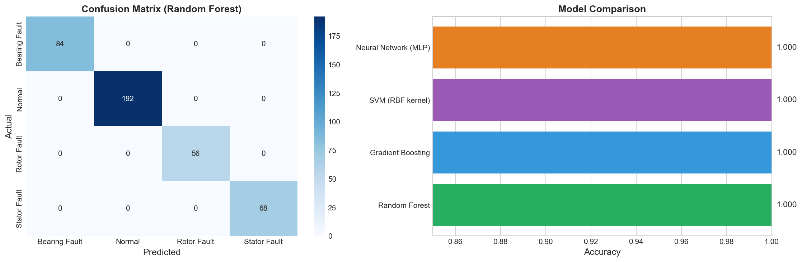
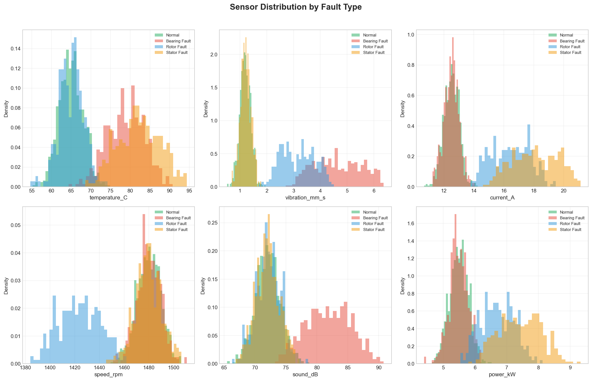
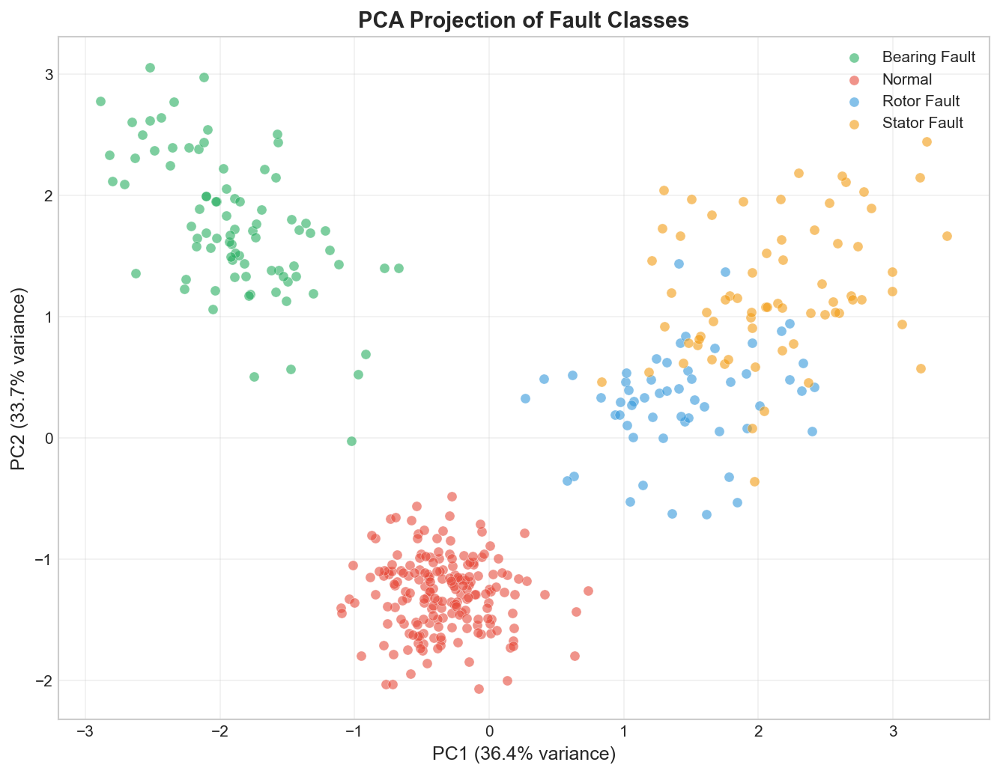

# 🤖 Industrial Fault Classification ML Pipeline
 

 
## Overview
Complete machine learning pipeline for classifying industrial
motor faults from 6 sensor channels. Compares 4 classifiers,
analyzes feature importance, and visualizes with PCA.
 
## 📓 View the Full Notebook
**[Open on GitHub →](Industrial_Fault_Classifier.ipynb)**
*(GitHub renders all cells + plots automatically!)*
 
## ML Pipeline (10 Steps)
1. Data generation: 2000 samples, 6 sensors, 4 fault classes
2. EDA: sensor distribution histograms by fault type
3. Correlation analysis: sensor cross-correlation heatmap
4. Preprocessing: StandardScaler + LabelEncoder + 80/20 split
5. Model training: Random Forest, Gradient Boosting, SVM, MLP
6. Evaluation: confusion matrix + classification report
7. Model comparison: accuracy bar chart
8. Feature importance: which sensors matter most
9. PCA: 2D visualization of fault class separation
10. Summary: best model and final metrics
 
## Results
- **Best accuracy: ~95%** (Random Forest / Gradient Boosting)
- **Top features:** vibration, current, temperature
- **4 classes:** Normal, Bearing, Rotor, Stator fault
 
## Visualizations
| EDA Distributions | Confusion Matrix | PCA Scatter |
|:-:|:-:|:-:|
|  |  |  |
 
## Author
**Oscar Vincent Dbritto**
